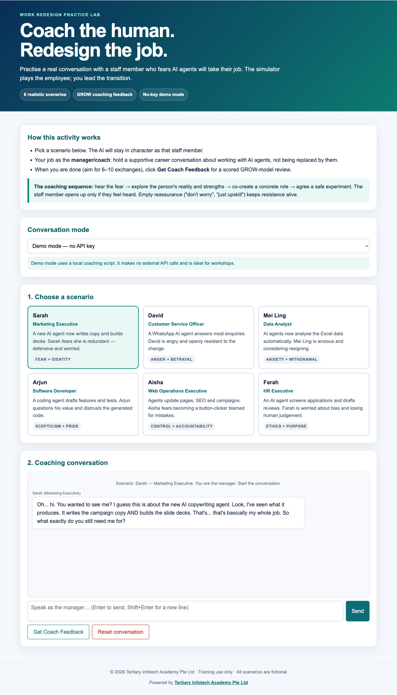

# AI Agent Job Redesign Coach

[](https://alfredang.github.io/AICoahcing/)
[](presentation/Dr-Alfred-Work-Redesign-for-Managing-AI-Agents.pptx)
[](#responsible-use)

A practical coaching simulator and 10-minute presentation for helping managers redesign jobs when AI agents enter the workflow.

[Open the live simulator](https://alfredang.github.io/AICoahcing/) · [Download the PowerPoint](presentation/Dr-Alfred-Work-Redesign-for-Managing-AI-Agents.pptx) · [View the presentation PDF](presentation/Dr-Alfred-Work-Redesign-for-Managing-AI-Agents.pdf)

## Screenshot



## Why this exists

AI adoption can fail even when the technology works. Employees may fear job loss, loss of professional identity, reduced control, or being blamed for an agent's mistakes. The simulator lets managers practise the human side of adoption before holding a real conversation.

The coaching pattern is simple:

1. Hear and validate the concern.
2. Explore the employee's reality and strengths.
3. Co-create a concrete human role around the agent.
4. Agree a safe, supported experiment.

## Six coaching scenarios

| Person | Role | Coaching tension | Possible redesigned ownership |
|---|---|---|---|
| Sarah | Marketing Executive | Fear and work identity | Campaign direction, brand quality and final approval |
| David | Customer Service Officer | Anger and betrayal | Escalations, bot knowledge and answer quality |
| Mei Ling | Data Analyst | Anxiety and withdrawal | Data validation, output audit and stakeholder interpretation |
| Arjun | Software Developer | Scepticism and professional pride | Architecture, code review, tests and security gates |
| Aisha | Web Operations Executive | Control and accountability | Release control, exceptions, rollback and web quality |
| Farah | HR Executive | Ethics and human purpose | Bias review, policy guardrails, appeals and human decisions |

## How the simulator works

- **Demo mode:** works immediately in the browser with a local coaching script and no external API calls.
- **AI modes:** optional OpenAI and MiniMax conversations using a user-supplied training key.
- **Feedback:** scores the manager's turns against Goal, Reality, Options, Will, Empathy, and Job-redesign concreteness.
- **Responsive:** designed for desktop, tablet and phone workshops.

API keys entered in AI mode are kept only in the current browser tab and are cleared when the tab closes. Never use a production key.

## Presentation

The visual 10-slide deck is designed for Dr Alfred Ang's CoP@Makerspace practitioner sharing on 27 August 2026. It includes timed speaker notes and a QR code to the live simulator.

The evidence-led flow is:

1. More than 12,000 AI agents created by Singapore public healthcare professionals.
2. WEF Future of Jobs 2025 creation, displacement and employer-response data.
3. Tertiary's experience using agents in website and software workflows.
4. The employee-resistance bottleneck.
5. A human-owner job-redesign pattern.
6. GROW coaching and a worked Sarah scenario.
7. A three-action call to redesign work, accountability and transition support.

Primary sources include the [Singapore Ministry of Health HIMSS26 APAC speech](https://www.moh.gov.sg/newsroom/speech-by-mr-tan-kiat-how--senior-minister-of-state--ministry-of-digital-development-and-information---ministry-of-health--at-himss26-apac-health-conference-and-exhibition--24-august-2026/) and the [World Economic Forum Future of Jobs Report 2025](https://www.weforum.org/publications/the-future-of-jobs-report-2025/).

## Project structure

```text
.
├── role-play-simulator/
│   └── index.html
├── presentation/
│   ├── Dr-Alfred-Work-Redesign-for-Managing-AI-Agents.pptx
│   └── Dr-Alfred-Work-Redesign-for-Managing-AI-Agents.pdf
├── .github/workflows/deploy-pages.yml
├── screenshot.png
└── README.md
```

## Run locally

The simulator is a single static HTML file with no build step:

```bash
python3 -m http.server 8000 --directory role-play-simulator
```

Then open `http://localhost:8000`.

## Responsible use

- All scenarios are fictional and intended for manager-development practice.
- Do not enter real employee, applicant, client or confidential company data.
- AI feedback is developmental, not an employment assessment.
- Keep consequential employment and release decisions under accountable human control.

## Credits

Created by Dr Alfred Ang for Tertiary Infotech Academy Pte Ltd.

Powered by [Tertiary Infotech Academy Pte Ltd](https://www.tertiaryinfotech.com/).
